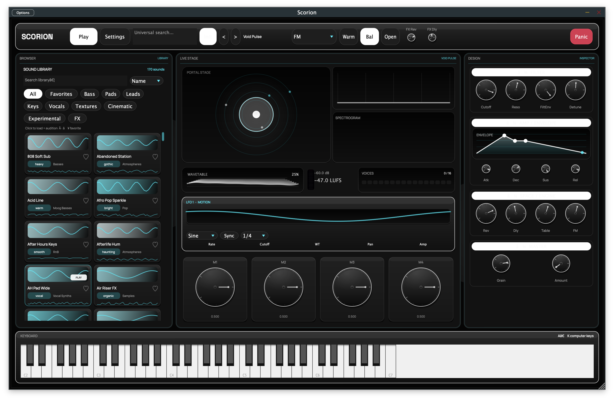

# Scorion

Flagship virtual instrument by **Wajih Kazmi**.

JUCE 8 · C++20 · **VST3** · **AU** · **Standalone**



## Features

- Five engines: Virtual Analog, Wavetable, FM, Granular, Sampler
- Sound library with search, collections, favorites, and audition
- Live stage: portal, scope, spectrogram, wavetable, LFO, macros
- Design inspector: filter, envelope, space, master
- Settings with five premium themes and HiDPI UI scale
- Host programs for DAW preset browsing
- Factory bank included

## Build

```bash
cmake -S . -B build -DCMAKE_BUILD_TYPE=Release -G Ninja
cmake --build build --parallel
./build/ScorionTests
```

### macOS

```bash
open build/Scorion_artefacts/Release/Standalone/Scorion.app
```

VST3 and AU artefacts are under `build/Scorion_artefacts/Release/`.

### Windows

```bash
cmake -S . -B build -DCMAKE_BUILD_TYPE=Release -DSCORION_BUILD_AU=OFF
cmake --build build --config Release --parallel
```

VST3 output: `build/Scorion_artefacts/Release/VST3/Scorion.vst3`

## Docs

| Doc | Purpose |
| --- | --- |
| [`docs/ENGINEERING_SPEC.md`](docs/ENGINEERING_SPEC.md) | Architecture & DSP |
| [`docs/PROGRESS.md`](docs/PROGRESS.md) | Milestone status |
| [`design-system/scorion/MASTER.md`](design-system/scorion/MASTER.md) | Visual system |
| [`Resources/LICENSES.md`](Resources/LICENSES.md) | Asset licenses |

## License notes

Factory wavetables and samples are original. See `Resources/LICENSES.md`.
