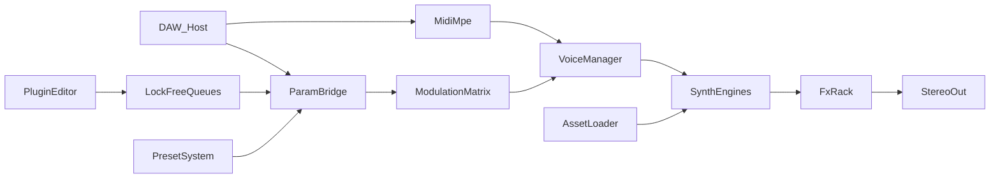

# Scorion — Flagship Virtual Instrument Engineering Specification

| Field | Value |
| --- | --- |
| Version | 1.0 |
| Status | Binding for implementation |
| Stack | JUCE 8, C++20, CMake, Catch2 |
| Targets | VST3, AU (macOS), Standalone |
| Platforms | macOS (Apple Silicon + Intel), Windows (x64) |
| AI features | Deferred (Appendix A only) |

This document is the source of truth for Scorion. Implementation proceeds milestone-by-milestone against the contracts below. Architecture changes require an update to this file first.

---

## 1. Vision and product goals

Scorion is an original professional virtual instrument: low latency, modular engines, high-quality DSP, a modern resizable UI, MPE, and a scalable preset system. It must feel like a flagship product in a DAW — stable under load, musically deep, and visually clear.

### 1.1 Product goals

- Multiple synthesis engines sharing one voice, modulation, and FX architecture.
- Deterministic realtime audio with no allocations or locks on the audio thread.
- Original factory content (presets and samples) — no copies of commercial libraries.
- Searchable, tagged preset browser and resizable HiDPI UI (dark and light).
- Ship as VST3 + AU + Standalone on macOS and Windows.

### 1.2 Success criteria

| Metric | Target |
| --- | --- |
| Round-trip plugin latency (beyond host buffer) | 0 additional samples unless oversampling or FX explicitly add delay; documented when they do |
| Stable buffer sizes | 32–2048 samples at 44.1 / 48 / 88.2 / 96 kHz |
| Voice count (default polyphony) | 16 polyphonic voices; steal policy documented |
| Crash rate in soak | Zero crashes in 4-hour automated soak at 48 kHz / 128 samples with continuous MIDI + automation |
| UI | Resizable, HiDPI-correct, keyboard-navigable primary controls |
| Tests | Every DSP/modulation module has unit tests where deterministic; audio regression fixtures for engines |

---

## 2. Non-goals (v1)

- **AI-assisted workflow / AI services** — deferred. See Appendix A. Not designed, scheduled, or stubbed as production modules in v1.
- **AAX** — not in v1.
- **Cloud licensing, accounts, or online preset sync** — not in v1.
- **Hardware controller companion apps** — not in v1 (MIDI learn is in scope).
- **Copying commercial presets, wavetables, or sample libraries** — forbidden.

---

## 3. System architecture

### 3.1 Principles

1. Separate **Audio Engine**, **DSP**, **Modulation**, **UI**, **Presets**, **Assets**, **MIDI/MPE**, and **FX**.
2. Never allocate memory, take mutexes, or perform unbounded I/O in the audio callback.
3. UI and audio communicate via lock-free queues and atomic/parameter bridges.
4. Assets (samples, wavetables) load on background threads; audio thread only swaps ready handles.
5. Prefer SIMD where profiling shows benefit; keep scalar fallbacks correct.

### 3.2 Repository layout

```text
ai-vst-plugin/
  README.md
  docs/ENGINEERING_SPEC.md
  CMakeLists.txt
  Source/
    PluginProcessor.h|.cpp
    PluginEditor.h|.cpp
    audio/          # process block orchestration, voice manager, param bridge
    dsp/            # oscillators, filters, envelopes, utilities, SIMD helpers
    synth/          # wavetable, va, fm, granular, sampler engines
    modulation/     # sources, matrix, macros, MIDI learn state
    fx/             # insert rack and individual effects
    presets/        # serialize/deserialize, browser index, factory manifests
    midi/           # MPE zones, note state, aftertouch routing
    ui/             # LookAndFeel, components, visualization
    assets/         # runtime asset handles and background loader
  Tests/
  Resources/        # factory presets, sample/wavetable packs (licensed original)
```

### 3.3 Data flow



### 3.4 Threading model

| Thread | Owns | Must not |
| --- | --- | --- |
| Audio (realtime) | Voice rendering, modulation tick, FX process, MIDI apply | Heap alloc, locks, file I/O, logging that allocates |
| Message / UI | Editor, browsers, graphics | Touch voice or engine mutable state except via queues/atomics |
| Background loader | Decode samples/wavetables, build mipmaps | Mutate live voice state; only publish ready asset IDs |
| Host automation | Parameter changes via JUCE `AudioProcessorValueTreeState` | Bypass the param bridge / smoother |

---

## 4. Module contracts

Conceptual APIs below are contracts for implementers. Names may map 1:1 to C++ types under `Source/`.

### 4.1 Audio engine (`audio/`)

**Responsibility:** Own the process block: prepare, MIDI, voices, sum, FX, output metering hooks.

```cpp
class AudioEngine {
public:
    void prepare(const ProcessSpec&);
    void reset();
    void process(juce::AudioBuffer<float>&, juce::MidiBuffer&);
    VoiceManager& voices();
    ModulationMatrix& modulation();
    FxRack& fx();
    ParamBridge& params();
};
```

**Thread ownership:** Audio thread for `process`; prepare/reset from message thread when not playing (or under host-guaranteed stop).

### 4.2 Param bridge (`audio/`)

**Responsibility:** Map APVTS parameters to realtime-smoothed values; apply sample-accurate automation blocks; expose modulation destinations.

Rules:

- All continuous parameters use one-pole or linear smoothers with configurable time (default 5–20 ms).
- Discrete parameters (engine select, sync modes) change at block boundaries unless noted sample-accurate.
- UI writes through APVTS; audio reads smoothed snapshots only.

### 4.3 Voice manager (`audio/`)

**Responsibility:** Allocate/steal voices, route notes (including MPE per-note pitch/pressure/timbre), sum engine outputs.

```cpp
class VoiceManager {
public:
    void prepare(const ProcessSpec&);
    void setPolyphony(int voices);           // 1..64, default 16
    void noteOn(const NoteEvent&);
    void noteOff(const NoteEvent&);
    void applyMpe(const MpeFrame&);
    void process(juce::AudioBuffer<float>&, int numSamples);
};
```

**Steal policy (v1):** Oldest quietest voice (lowest envelope gain among oldest N candidates). Documented constant: prefer releasing vs sustaining.

### 4.4 Synth engines (`synth/`)

Shared interface:

```cpp
class ISynthEngine {
public:
    virtual ~ISynthEngine() = default;
    virtual void prepare(const ProcessSpec&) = 0;
    virtual void reset() = 0;
    virtual void noteOn(VoiceId, const NoteEvent&) = 0;
    virtual void noteOff(VoiceId, const NoteEvent&) = 0;
    virtual void render(VoiceId, float* left, float* right,
                        int numSamples, const ModulatedParams&) = 0;
};
```

Engines: `WavetableEngine`, `VirtualAnalogEngine`, `FmEngine`, `GranularEngine`, `SamplerEngine`.

A preset selects a **primary engine** (v1: one engine per preset). Dual-engine layering is post-v1.

### 4.5 DSP library (`dsp/`)

**Responsibility:** Band-limited oscillators, ZDF filters, oversamplers, interpolators, envelopes, noise, denormal flush helpers, SIMD kernels.

No UI or file I/O dependencies. Pure DSP + minimal state.

### 4.6 Modulation (`modulation/`)

See Section 7. Owns sources, matrix, macros, MIDI learn map. Tick once per sample or per block with sample-accurate events as required.

### 4.7 MIDI / MPE (`midi/`)

**Responsibility:** Parse host MIDI; maintain MPE zone config (default lower zone, 15 member channels); emit `NoteEvent` / `MpeFrame`.

### 4.8 FX rack (`fx/`)

Serial insert chain after voice sum. See Section 8.

### 4.9 Presets and assets (`presets/`, `assets/`)

Presets serialize parameter trees + asset references. Assets load asynchronously; engines hold `AssetHandle` that is either Ready or Missing (silence / fallback oscillator).

### 4.10 UI (`ui/`, `PluginEditor`)

Reads state via attachments and lock-free visualization queues (waveforms, mod meters). Never calls engine `render` directly.

---

## 5. DSP and realtime requirements

### 5.1 Hard realtime rules

1. No `new` / `delete` / `malloc` / standard containers that allocate in `process`.
2. No `std::mutex`, `CriticalSection`, or blocking atomics spins in `process`.
3. No file, network, or font loading in `process`.
4. Preallocate voices, delay lines, grain pools, and scratch buffers in `prepare`.
5. Flush denormals (DAZ/FTZ or equivalent) at process entry on supported CPUs.

### 5.2 Oscillators

- Wavetable and VA classic waveforms must be **band-limited** (PolyBLEP / BLEP / mipmapped wavetable).
- Naive aliased oscillators are allowed only for intentionally harsh FX-style noise paths, labeled as such.
- Phase is double or high-precision float accumulator; frequency from MIDI + pitch mod + MPE.

### 5.3 Filters

- Primary filters: **zero-delay feedback (ZDF)** state-variable or ladder designs as appropriate per engine.
- Stable under fast cutoff modulation; clamp resonance to safe ranges.
- Optional oversampling for nonlinear filter / saturation paths (see 5.4).

### 5.4 Oversampling

| Path | Default | Notes |
| --- | --- | --- |
| VA nonlinear / hard sync | 2x when drive > threshold | Document latency compensation |
| Saturator / clipper FX | 2x | |
| Linear wavetable / FM | 1x | Rely on band-limiting |
| Reverb / delay | 1x | |

Oversampling latency must be reported to the host via JUCE latency samples when enabled.

### 5.5 Interpolation

- Sampler / granular playback: Hermite or equivalent high-quality interpolation; linear only for preview/low-quality mode if exposed.
- Wavetable frame morph: crossfade between adjacent frames with mip selection by playback frequency.

### 5.6 Voice management DSP

- Per-voice amp envelope is mandatory before voice recycle.
- Soft voice steal: fade-out ≤ 5 ms on stolen voice.
- Global unison: up to 8 detuned voices per note for VA/wavetable (counts against polyphony or uses sub-voices — **v1 decision: sub-voices within a note slot, max 8, do not multiply polyphony count**).

### 5.7 SIMD

- Use JUCE DSP / platform SIMD for summing, smoothing, and FIR/oversampling where beneficial.
- Keep algorithms correct in scalar debug builds; add benchmarks before optimizing.

---

## 6. Synthesis engines

### 6.1 Shared voice model

Each sounding note has a `Voice` with:

- Engine instance state for the selected engine
- Amp envelope (ADSR + optional delay/hold)
- Filter envelope (optional)
- Per-note MPE offsets (pitch, pressure, timbre)
- Unison sub-voice state when enabled

Global modulation matrix outputs are applied into `ModulatedParams` before `render`.

### 6.2 Feature matrix

| Capability | Wavetable | VA | FM | Granular | Sampler |
| --- | --- | --- | --- | --- | --- |
| Polyphony | Yes | Yes | Yes | Yes | Yes |
| Unison | Yes | Yes | Limited (2) | No | No |
| Filter (ZDF) | Yes | Yes | Yes | Yes | Yes |
| Hard sync | — | Yes | — | — | — |
| Multi-op | — | — | 4-op | — | — |
| Sample/table asset | Table | — | — | Sample | Sample/multi |
| MPE | Yes | Yes | Yes | Yes | Yes |

### 6.3 Wavetable engine

**Parameters (core):** table select, position, position mod depth, warp/mode, octave/semi/fine, unison count/detune/spread, amp, pan, filter cutoff/res/type, filter env amount.

**Behavior:**

- Factory and user wavetables as one-shots of N frames (N ≥ 2, typically 256).
- Mipmapped per frame; position morphs between frames.
- Original tables only in factory pack.

### 6.4 Virtual analog engine

**Oscillators:** 2–3 oscillators: saw, square/pulse (PWM), triangle, sine; noise.

**Extras:** Hard sync (osc2←osc1), ring mod, sub oscillator (-1 oct), unison.

**Filter:** ZDF ladder and/or SVF multimode; key tracking; drive.

### 6.5 FM engine

**Operators:** 4 operators, sine (and optional shaped sine), per-op ratio/offset, level, feedback on op1.

**Algorithms:** Fixed set of 8 algorithms (algorithm index parameter).

**Modulation:** Amp and pitch envelopes per operator simplified via shared envelopes + matrix destinations for op levels / ratios.

### 6.6 Granular engine

**Source:** Loaded sample (mono/stereo).

**Grain pool:** Preallocated max grains (e.g. 64 per voice or shared pool with hard cap).

**Parameters:** position, spray, grain size, density/rate, pitch, reverse probability, window type, stereo scatter.

**Realtime:** No dynamic grain allocation; steal oldest grain if pool exhausted.

### 6.7 Sampler engine

**Modes:** Single sample, multi-sample keyzones (velocity layers optional in v1.1; v1: keyzones + velocity crossfade optional simple 2-layer).

**Parameters:** root key, tune, loop on/off (forward loop), loop start/end, start offset, filter, amp envelope.

**Streaming:** v1 loads samples fully into memory after background decode (cap documented; large libraries may be multi-mic later). No disk streaming in v1.

### 6.8 Engine selection and CPU

Engine is a discrete parameter. Switching engines on a live preset stops voices and re-prepares engine state. CPU budget differs by engine; UI may show a simple “CPU hint” later — not required for Milestone 1.

---

## 7. Modulation system

### 7.1 Sources (v1)

| Source | Count (default max) | Notes |
| --- | --- | --- |
| AHDSR envelopes | 4 | Amp uses env1 by default |
| LFOs | 4 | Waveforms: sine, tri, saw, square, S&H, smooth random; tempo sync |
| Macros | 8 | User-named in preset |
| MIDI | Velocity, keytrack, mod wheel, aftertouch, expression | |
| MPE | Per-note pitch bend, pressure, timbre | |
| Random | 2 bipolar random (trigger on note or free) | |
| Constant / offset | Via matrix bias | |

“Unlimited” from the starter vision is interpreted as **soft-capped high limits** with fixed preallocated pools (defaults above; compile-time max ≥ defaults). Raising caps must not allocate on the audio thread.

### 7.2 Matrix

- Rows: sources; columns: destinations (or list of connection slots).
- v1: **64 connection slots**, each `{ sourceId, destId, depth, bipolar/unipolar, curve }`.
- Destinations include: osc pitch/level/pan, filter cutoff/res, morph/position, FX sends/wet, macro→nested, granular position/density, FM op levels, etc.
- Depth is modulatable by macros where useful (one level of indirection max in v1).

### 7.3 MIDI learn

- Message thread assigns CC → parameter ID.
- Stored in preset and in a global user map (user map overrides when enabled).
- Audio thread only reads the resolved CC→param table (atomic publish of table pointer/generation).

### 7.4 Timing

- LFOs and envelopes update at audio rate when destinations require it (pitch, filter); block-rate allowed for slow destinations if error is inaudible — prefer audio-rate for v1 simplicity unless profiling demands otherwise.

---

## 8. Effects rack

### 8.1 Topology

Single serial insert chain after voice sum, stereo throughout:

`Input Gain → [slots] → Soft Clip / Safety → Output Gain / Limiter`

### 8.2 v1 insert effects (ordered catalog; user order via rack slots)

| Slot effect | Key parameters |
| --- | --- |
| EQ (3-band parametric) | Low/mid/high freq, gain, Q |
| Filter (SVF) | Type, cutoff, res, drive |
| Chorus / Flanger | Rate, depth, feedback, mix |
| Delay | Time (sync/ms), feedback, ping-pong, mix, high-pass damp |
| Reverb | Size, decay, damp, predelay, mix |
| Saturator | Drive, type (tape/soft/hard), mix |
| Limiter (end) | Ceiling, release; always last safety option |

v1 rack: **up to 6 user slots** + fixed output limiter. Bypass per slot; wet/dry where applicable.

### 8.3 Latency

Time-based FX do not add PDC beyond internal delay lines (host hears wet delay as effect, not reported as latency). Oversampled saturator/filter reports latency when oversampling is on.

---

## 9. Preset and factory library

### 9.1 Preset format

- On disk: JSON (human-auditable) + optional binary `.scpreset` pack for factory.
- Contents: schema version, engine id, parameter values, modulation matrix, FX rack, macro names, asset references (relative IDs), tags, category, author, rating (optional).
- Host state: APVTS + custom ValueTree chunk for matrix/assets not expressed as float params.

### 9.2 Browser

- Search by name and tags.
- Categories: Pianos, Pads, Basses, Leads, Textures, Cinematic Atmospheres, Plucks, Percussion, Evolving Soundscapes, User.
- Favorites and recents stored in user settings (not in project unless saved).

### 9.3 Factory library

- Original presets covering all categories above.
- Original wavetables and samples only; track licenses in `Resources/LICENSES.md` when content lands.
- Minimum bar for “complete factory”: ≥ 100 presets spanning all engines and categories (stretch goal; ship quality over empty quantity).

### 9.4 Asset references

```text
asset://wavetable/<pack>/<name>
asset://sample/<pack>/<name>
```

Missing assets: preset loads; engine outputs silence or a built-in sine fallback and UI shows a missing-asset badge.

---

## 10. UI / UX

### 10.1 Requirements

- Resizable editor; define min size (e.g. 900×560) and default (1200×720).
- HiDPI / retina: all artwork vector or @2x; no blurry knobs.
- Dark and light themes via LookAndFeel tokens (CSS-like color roles in code: background, surface, accent, danger, text primary/secondary).
- Keyboard accessible: tab focus for browser and primary params; space toggles play in standalone where applicable.
- Sections: header (preset name/prev/next/save), engine panel, modulation, FX, browser drawer/panel.
- Visualizations: osc/wavetable display, envelope/LFO shapes, simple mod activity meters; fed by lock-free probe queues.

### 10.2 Performance of UI

- Timer/UI refresh ≤ 30–60 Hz for meters; do not pull large buffers every frame.
- Waveform snapshots downsampled on audio thread into a fixed ring, consumed by UI.

### 10.3 Accessibility

- Contrast meeting readable levels in both themes.
- Parameter names exposed to host automation with clear labels.
- No information conveyed by color alone for clipped/missing states (icon + text).

---

## 11. Performance and quality bars

### 11.1 CPU guidance

| Scenario | Budget guideline |
| --- | --- |
| 16 VA voices + filter + light FX @ 48 kHz / 128 | Comfortable on mid-tier laptop CPU (leave headroom; profile on CI reference machine) |
| Granular dense patches | May use fewer voices; UI warns if grain pool saturated |

Exact percent-of-core numbers are machine-specific; gate releases on soak + profiling, not a single magic number.

### 11.2 Profiling

- Instrument hot paths with optional compile flag `SCORION_PROFILE`.
- Benchmarks in `Tests/` for oscillators, filters, matrix tick, granular render.

### 11.3 Automated tests

- Unit: envelopes, smoothers, PolyBLEP, matrix depth, MIDI learn map, preset round-trip JSON.
- Process: offline render of known MIDI → WAV hash/tolerance compare for regression.
- Pluginval (or equivalent) in CI for VST3/AU validation builds.

### 11.4 Quality

- No audible zipper noise on parameter changes under automation.
- No stuck notes after panic (MIDI CC All Notes Off / UI panic).
- Denormal storms must not inflate CPU on silent reverb tails (noise floor / denormal protection).

---

## 12. Build, CI, and packaging

### 12.1 Build

- CMake 3.22+ with FetchContent or submodule for JUCE 8.
- Presets: `Debug`, `Release`, `RelWithDebInfo`.
- Options: `SCORION_BUILD_TESTS`, `SCORION_BUILD_VST3`, `SCORION_BUILD_AU`, `SCORION_BUILD_STANDALONE`.
- C++20 required; warnings-as-errors in CI Release builds.

### 12.2 CI

- macOS and Windows pipelines: configure, build, unit tests, (where secrets allow) codesign.
- Run pluginval on built VST3 when available.
- Artifact upload: VST3/AU/Standalone zip per platform.

### 12.3 Packaging

- macOS: signed/notarized app + Audio Units / VST3 installer or pkg (details when certificates available).
- Windows: VST3 under Common Files; Standalone installer (Inno Setup or equivalent).
- Versioning: `MAJOR.MINOR.PATCH` from CMake; embedded in plugin description.

---

## 13. Implementation milestones

Build subsystem-by-subsystem. **Exit criteria** must pass before starting the next milestone. AI work is not a milestone.

### M1 — Core framework

**Deliver:** CMake + JUCE project; `PluginProcessor` / `PluginEditor` shells; APVTS skeleton; `AudioEngine` process graph with passthrough + MIDI log; lock-free queue utility; Catch2 wired.

**Exit:** Standalone and VST3 build on at least one platform; unit test target runs; silence or click-free passthrough; documented run instructions in README.

### M2 — Oscillators and voices

**Deliver:** Voice manager; PolyBLEP VA oscillators (saw/square/tri/sine); basic ADSR amp; MIDI note on/off; polyphony + steal; parameter smoothing.

**Exit:** Playable VA sine/saw poly synth; no alloc in process (debug assert or heap hook test); tests for oscillator period / envelope.

### M3 — Filters and modulation

**Deliver:** ZDF filter; 4 envs / 4 LFOs / 8 macros; modulation matrix (64 slots); MPE basics; MIDI learn.

**Exit:** Filter + LFO→cutoff musical demo preset; MPE pitch/pressure audible in a supporting host; matrix round-trip in preset blob.

### M4 — Effects

**Deliver:** FX rack slots; EQ, filter, chorus/flanger, delay, reverb, saturator, limiter; bypass/mix; latency reporting for OS paths.

**Exit:** Rack serial processing verified; delay sync to tempo; limiter prevents overs on 0 dBFS sine stress.

### M5 — Sampler and granular

**Deliver:** Asset loader (background); sampler engine with loop; granular engine with fixed grain pool; browser hook for sample pick.

**Exit:** Load WAV → play chromatically; granular density/position presets; missing asset safe path.

### M6 — Wavetable and FM

**Deliver:** Wavetable engine + factory tables; FM 4-op + algorithms; engine select parameter.

**Exit:** Morphing wavetable preset; FM bell/bass algorithms; engine switch without crash.

### M7 — Preset browser

**Deliver:** JSON preset I/O; tags/categories; factory bank scaffold; prev/next/save; search.

**Exit:** Full preset round-trip; factory folder loads; user save to user dir.

### M8 — UI polish

**Deliver:** Final layout, themes, visualizations, keyboard focus, browser UX, HiDPI assets.

**Exit:** Dark/light complete; resize stable; visualization non-blocking; accessibility pass checklist.

### M9 — Optimization and testing

**Deliver:** Profiling pass; SIMD where justified; pluginval clean; soak test; regression WAVs; packaging scripts.

**Exit:** CI green on macOS + Windows; soak 4 h clean; release checklist signed off.

---

## 14. Risks and technical debt

| Risk | Mitigation |
| --- | --- |
| Factory sample/wavetable licensing | Commission or generate original content; maintain `Resources/LICENSES.md` |
| DAW MIDI/MPE quirks | Test Ableton, Logic, Reaper, FL, Cubase matrix; document host notes |
| AU validation failures | Early AU builds from M1; pluginval + Logic |
| Granular CPU spikes | Hard grain caps; voice limits on granular presets |
| Preset schema churn | Schema version field; migration functions |
| Oversampling latency surprises | Always report latency; UI indicator when OS active |
| Scope creep into AI | Keep Appendix A non-binding; no AI milestones until a new spec revision |

---

## 15. Parameter and naming conventions

- Parameter IDs: stable `camelCase` strings (e.g. `filterCutoff`, `lfo2Rate`); never rename without migration.
- User-facing names: Title Case with units in host (“Filter Cutoff”, “Hz” via JUCE meta).
- Decibel parameters store linear gain internally where DSP needs gain; convert at edges.
- Tempo sync: boolean `*Sync` + division enum per synced control.

---

## 16. Panic, transport, and host interaction

- All Notes Off / All Sound Off respected.
- UI Panic button clears voices and grain pools.
- Soft pedal / sustain CC64 held notes.
- Bypass: host bypass leaves plugin latency consistent when oversampling state unchanged.

---

## Appendix A — Future AI (non-binding)

The original product vision included AI-assisted workflow (e.g. patch suggestion, tagging, or sound-design helpers). **This is explicitly out of scope for v1.** No AI services, network calls, or on-device model runtimes are scheduled in milestones M1–M9.

A future revision may add:

- Offline or optional on-device assist for preset naming/tagging
- Natural-language → parameter mapping experiments
- Separation of AI as a non-realtime service process (never on the audio thread)

Until that revision is accepted, do not add AI modules, stubs that imply shipping AI, or milestone work for AI.

---

## Appendix B — Glossary

| Term | Meaning |
| --- | --- |
| APVTS | JUCE `AudioProcessorValueTreeState` |
| ZDF | Zero-delay feedback filter |
| MPE | MIDI Polyphonic Expression |
| PDC | Plugin delay compensation |
| Steal | Freeing a voice for a new note when polyphony is exhausted |

---

## Document history

| Version | Date | Notes |
| --- | --- | --- |
| 1.0 | 2026-07-22 | Full engineering spec from starter; AI deferred; Markdown source of truth |
